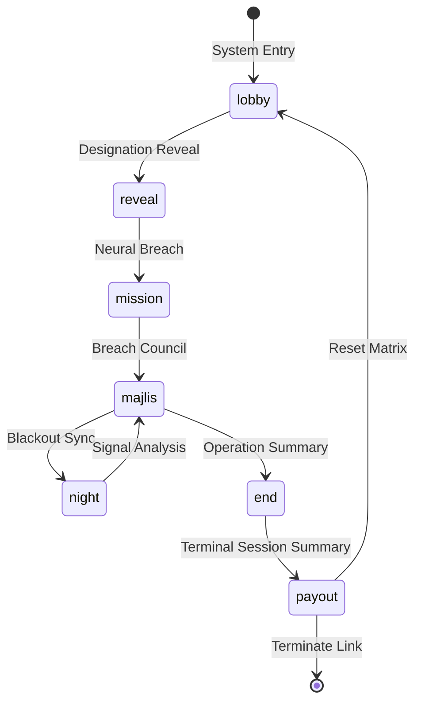
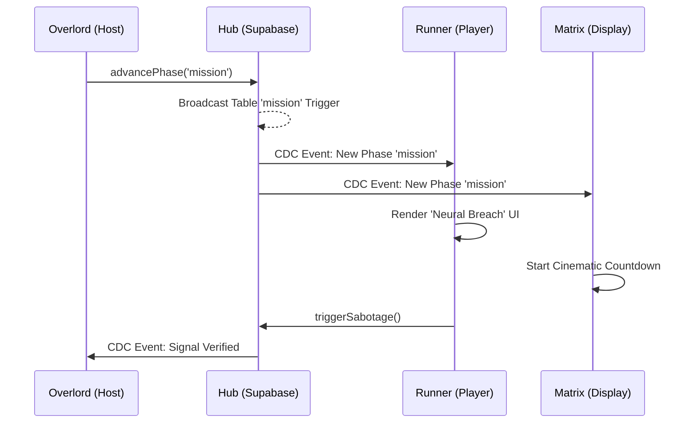

# Cyber-Shadows: Project Architecture & Structural Parallels

## 🕯️ The Concept
"Cyber-Shadows" is a real-time digital heist set in the neon-noir underground of a centralized network. An **Overlord AI** controls the **Data-Vault** (`eidi_pot`), which contains the collective wealth of the sector. A group of elite **Glitch-Runners** has infiltrated the system to bypass the firewalls. However, the team has been compromised by **System-Spies**—rogue nodes whose goal is to sabotage the breach and secure the credits for themselves.

## 🎭 Visual Identity: Digital Neon-Noir
The game features a high-fidelity, cinematic aesthetic defined by:
- **Palette**: Deep charcoal backgrounds with vibrant Neon Cyan (`#00F3FF`) and Magenta (`#FF00FF`) accents.
- **Typography**: Monospaced fonts (JetBrains Mono) and clean Sans-Serif (Inter) to evoke a "Terminal Interface" feel.
- **Atmosphere**: Glassmorphism, scanning light effects, and glitch-transitions.

## 🕹️ Gameplay Loop

### 1. Mission Phase (Neural Breach Challenge)
- **Objective:** Glitch-Runners must complete a logical or technical challenge set by the Overlord.
- **Neural Breach Timing (150 seconds):**
    - **Neural Isolation (60 seconds):** All players (except System-Spies) are blindfolded (simulated neural isolation). System-Spies use this window to view their secret assignment and coordinate.
    - **Encryption Solving (90 seconds):** All players open their eyes. The group works together to solve the technical/logical challenge before the timer hits 0.
- **Unanimous Sabotage:** In games with multiple System-Spies, **all active System-Spies** must trigger their 'Sabotage' signal for it to be verified.
    - **Verification:** Once confirmed by the Overlord (after a unanimous signal or mission timeout), the mission is considered "Sabotaged".
    - **The Breach Penalty:** A successful sabotaged mission adds only **1000 Credits** to the vault (vs 2000).
    - **System Leak Reward**: Verified signaling Spies receive **1000 Credits** in `private_gold` immediately.
    - **Immediate Feedback:** Signaling provides tactile feedback with "Signaling..." button states.

### 2. Breach Council (The Termination)
- **Objective:** Debate and identify the infiltrators in the matrix.
- **System Termination:** Players vote on who to deactivate. The Overlord then reveals the tally.
- **Node Statuses** (`theme-config.ts`):
    - **SYNCED** (`alive`): Authorized node within the network.
    - **DEACTIVATED** (`banished`): Node removed from active sync; enters spectate mode.
- **Hardened Tie-Breaking:** If the vote is tied, the Overlord Protocol is invoked (Decree, Re-vote, or Neural Override).

### 3. Blackout Sync (Phase: `night`)
- **Objective:** System-Spies choose a node to jam.
- **Signal Jamming:** The victim is set to **OFFLINE** for the blackout window and is prohibited from sending signals or interacting in the next Breach Council.

### 4. Operation Summary (Phase: `end`)
- **Objective:** Showcase the total credits accumulated across the entire gathering.
- **Extraction Ceremony:** The matrix transitions to a grand leaderboard ranked by `Session Credits` (`gathering_gold`). The Overlord distributes the final Data-Vault credits to the winning survivors.

## ⚙️ Game Engine & Architecture

### 1. The Synchronized State Machine
The core of the game is a **Finite State Machine (FSM)** where the `game_rooms.current_phase` acts as the global state controller.

### 2. Data Flow Model (DFD Context)
The project utilizes a **Unidirectional Data Flow** pattern mediated by Supabase.

## 🗂️ Project Folder Structure

A high-level overview of the repository's organization:

- **`src/app/`**: Next.js App Router root.
    - `host/`: Overlord Dashboard (State authority).
    - `play/`: Runner Terminal (Action node).
    - `display/`: Public Matrix (System-wide visual state).
    - `join/`: Node entry and registration.
    - `globals.css`: Modern neon-noir CSS variables and animations.
- **`src/hooks/`**: Real-time synchronization hooks.
    - `useGameState.ts`: Autorun sync for `game_rooms`.
    - `usePlayers.ts`: Autorun sync for `players`.
- **`src/lib/`**: Business logic and static configurations.
    - `game-logic.ts`: The central engine (Rules, Roles, Wealth).
    - `theme-config.ts`: Visual tokens and phase labels.
    - `supabase.ts`: Hub connectivity configuration.
- **`supabase/`**: Database infrastructure.
    - `clean_init.sql`: Table definitions, enums, and RLS policies.
    - `logical_missions.sql`: High-stakes technical challenge seeds.

## 🏰 Parallels with "The Traitors"

| Feature | The Traitors (UK/US) | Cyber-Shadows |
| :--- | :--- | :--- |
| **Loyal Faction** | Faithfuls | Glitch-Runners |
| **Infiltrator Faction** | Traitors | System-Spies |
| **Mission Activity** | Money Building | Neural Breach (`Data-Vault`) |
| **Banishment Ceremony** | The Round Table | The Breach Council |
| **Infiltrator Action** | The Murder | Signal Jamming (`Blackout Sync`) |
| **Eliminated Players** | Banished/Murdered | **DEACTIVATED** (Ghosting Mode) |
| **Final Reward** | The Prize Fund | Extraction Credits |
| **Multi-Round Goal** | The Full Season | The Gathering (Cumulative Wealth) |
